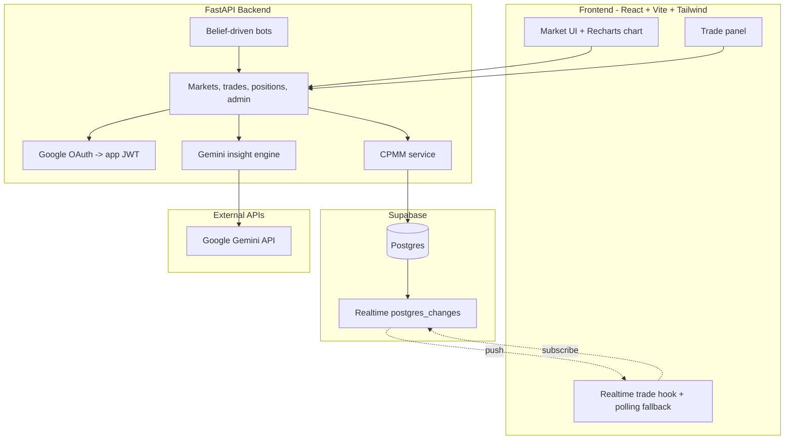

# Knightshi

**Knightshi** is a UCF-themed binary prediction-market simulation built with virtual credits for the **BloomKnights** competition. Users buy YES/NO shares in demo markets, prices move through a constant-product market maker (CPMM), and belief-driven bots simulate a crowd so judges can watch prices converge toward a hidden probability in real time.

This is a simulation only. It uses virtual credits and is not gambling.

## Demo Markets

| Market | Resolves via | Demo state |
| --- | --- | --- |
| UCF football historical replay | ESPN box score | Resolvable |
| COP3502 Exam 1 mean >= 80 | Canvas instructor post | Resolvable |
| UCF Fall 2026 enrollment > 75,000 | Official enrollment figure | Left open/unresolved |
| UCF covers the spread vs USF | Box score + published line | Proof of concept |
| UCF Hackathon 2026 draws 400+ hackers | Organizer headcount | Proof of concept |
| Meal-plan base price flat Fall 2026 | Housing published rates | Proof of concept |

## Tech Stack

- **Frontend:** React 18, TypeScript, Vite, Tailwind CSS, Framer Motion, Recharts, Supabase Realtime.
- **Backend:** FastAPI, SQLAlchemy, Alembic, Supabase Postgres, JWT auth.
- **AI:** Gemini through `google-genai` for one insight feature.
- **Auth:** Google OAuth or demo email login with an app JWT.

## Architecture



## How It Works

Each market has YES and NO liquidity pools. The market maker preserves `x * y = k`, where `x` is the YES pool and `y` is the NO pool. A YES price is read approximately as `y / (x + y)`.

Trades update the pools, user positions, and trade history. Supabase Realtime pushes new trades to connected clients, with a 3-second polling fallback for demo safety.

Admin-triggered bots trade from private beliefs sampled around a hardcoded `p_true`, creating the live convergence that makes the demo readable without needing a large audience.

## Project Structure

```text
Knightshi/   (repo folder may still be UCF-Prediction-Market-)
├── README.md
├── LICENSE.md
├── AGENTS.md
├── CLAUDE.md
├── DESIGN.md
├── MOTION.md
├── .env.example
├── docs/
│   └── RAILWAY.md
├── backend/
│   ├── main.py
│   ├── auth/
│   ├── models/
│   ├── routes/
│   ├── services/
│   ├── bots/
│   ├── ai/
│   ├── realtime/
│   └── migrations/
└── frontend/
    ├── vite.config.ts
    ├── public/
    └── src/
        ├── components/
        ├── hooks/
        ├── lib/
        ├── motion/
        └── pages/
```

## Setup

Prerequisites:

- Node.js 20+.
- Python 3.11+.
- A Supabase project with Postgres.
- Google OAuth credentials (optional for local demo — email login works).
- A Gemini API key from Google AI Studio (optional; insight degrades safely when unset).

Create your local environment file:

```bash
cp .env.example .env
```

Fill in the blank values in `.env`. Never commit real secrets.

Backend:

```bash
python -m venv .venv
source .venv/bin/activate
pip install -r requirements.txt
alembic -c alembic.ini upgrade head
python -m backend.seed
```

Frontend:

```bash
cd frontend && npm install
```

Keep dependencies in `.venv` and `frontend/node_modules` — do not commit them. Run the API with uvicorn; it exposes `/health`. The frontend points to it through `VITE_API_BASE_URL`. Gemini insight degrades to a calm fallback whenever `GEMINI_API_KEY` is unset, so the trading core never depends on the AI being up.

## Deploy (Railway)

Production uses two Railway services (API + frontend SPA). See [`docs/RAILWAY.md`](docs/RAILWAY.md) for root directories, env vars, and the `VITE_API_BASE_URL` deploy order.

## Demo Day Runbook

Start both services (two terminals, from repo root):

```bash
source .venv/bin/activate && uvicorn backend.main:app --reload --port 8000
cd frontend && npm install && npm run dev   # http://localhost:5173
```

Optional clean slate before judging — resets demo markets to 0.50, wipes their
trades/positions, and restores wallets to the initial grant (dev DB only):

```bash
python -m backend.seed --reset-demo
```

Demo path:

1. Browse the landing page at `http://localhost:5173/` — animated hero, market preview, and campus demo sections.
2. Sign in at `/login` with an email listed in `ADMIN_EMAILS` (Google or demo email login).
3. Open the UCF football market — probability bar and price chart on screen.
4. From **Admin**, start **Simulate** — bot trades land every 1–3 s and the price converges toward the hidden `p_true` live.
5. On the market page, click **Get insight** — Gemini explains the price action in plain English.
6. Visit **AI Brief** (`/features`) — one Gemini read per market, auto-loaded.
7. Stop the simulation, then **Resolve** the market from Admin to show payouts and portfolio P/L.

If Google sign-in complains about origins, use the demo email login — the whole path works without Google, Supabase, or Gemini being reachable.

## Testing

```bash
source .venv/bin/activate && pytest backend/tests
cd frontend && npm test
```

## Agent Context

For AI-assisted development, start new coding sessions by reading:

- `AGENTS.md` for build order, locked decisions, and guardrails.
- `.cursor/rules/*.mdc` for Cursor-scoped coding rules.
- `CLAUDE.md` for Claude Code session bootstrap.
- `DESIGN.md` for UI tokens and frontend design guidance.
- `MOTION.md` for Framer Motion choreography on the landing route.

## License

MIT — see [`LICENSE.md`](LICENSE.md).

## Disclaimer

Knightshi is a prediction-market simulation for demonstration and education. It uses virtual credits only.
