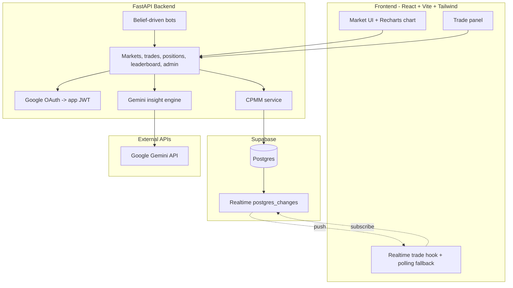

# BloomKnights

UCF-themed binary prediction-market simulation built with virtual credits. Users buy YES/NO shares in demo markets, prices move through a constant-product market maker (CPMM), and belief-driven bots simulate a crowd so judges can watch prices converge toward a hidden probability in real time.

This is a simulation only. It uses virtual credits and is not gambling.

## Demo Markets

| Market | Resolves via | Demo state |
| --- | --- | --- |
| UCF football historical replay | ESPN box score | Resolvable |
| COP3502 Exam 1 mean >= 80 | Canvas instructor post | Resolvable |
| UCF Fall 2026 enrollment > 75,000 | Official enrollment figure | Left open/unresolved |

## Tech Stack

- **Frontend:** React 18, TypeScript, Vite, Tailwind CSS, Recharts, Supabase Realtime, Axios.
- **Backend:** FastAPI, SQLAlchemy, Alembic, Supabase Postgres, JWT auth.
- **AI:** Gemini through `google-genai` for one insight feature.
- **Auth:** Google OAuth flow with an app JWT.

## Architecture



## How It Works

Each market has YES and NO liquidity pools. The market maker preserves `x * y = k`, where `x` is the YES pool and `y` is the NO pool. A YES price is read approximately as `y / (x + y)`.

Trades update the pools, user positions, trade history, and leaderboard. Supabase Realtime pushes new trades to connected clients, with a 3-second polling fallback for demo safety.

Admin-triggered bots trade from private beliefs sampled around a hardcoded `p_true`, creating the live convergence that makes the demo readable without needing a large audience.

## Project Structure

```text
bloomknights/
├── README.md
├── AGENTS.md
├── CLAUDE.md
├── DESIGN.md
├── .env.example
├── backend/
│   ├── main.py
│   ├── auth/
│   ├── models/
│   ├── routes/
│   ├── services/
│   ├── bots/
│   ├── ai/
│   ├── realtime/
│   └── migrations/
└── frontend/
    ├── tailwind.config.cjs
    ├── public/
    └── src/
        ├── components/
        ├── hooks/
        ├── lib/
        └── pages/
```

## Setup

Prerequisites:

- Node.js 18+.
- Python 3.11+.
- A Supabase project.
- Google OAuth credentials.
- A Gemini API key from Google AI Studio (needed later for market insight; not required for current trading core).

Create your local environment file:

```bash
cp .env.example .env
```

Fill in the blank values in `.env`. Never commit real secrets.

Backend (current trading core):

```bash
python -m venv .venv
source .venv/bin/activate
pip install -r requirements.txt
```

Keep dependencies in `.venv` — do not commit the virtualenv. Run the API with uvicorn once wired; it should expose `/health`. The frontend should point to it through `VITE_API_BASE_URL`. Gemini insight is planned and not implemented in this branch yet.

## Agent Context

For AI-assisted development, start new coding sessions by reading:

- `AGENTS.md` for build order, locked decisions, and guardrails.
- `.cursor/rules/*.mdc` for Cursor-scoped coding rules.
- `CLAUDE.md` for Claude Code session bootstrap.
- `DESIGN.md` for UI tokens and frontend design guidance.

## Disclaimer

BloomKnights is a prediction-market simulation for demonstration and education. It uses virtual credits only.
